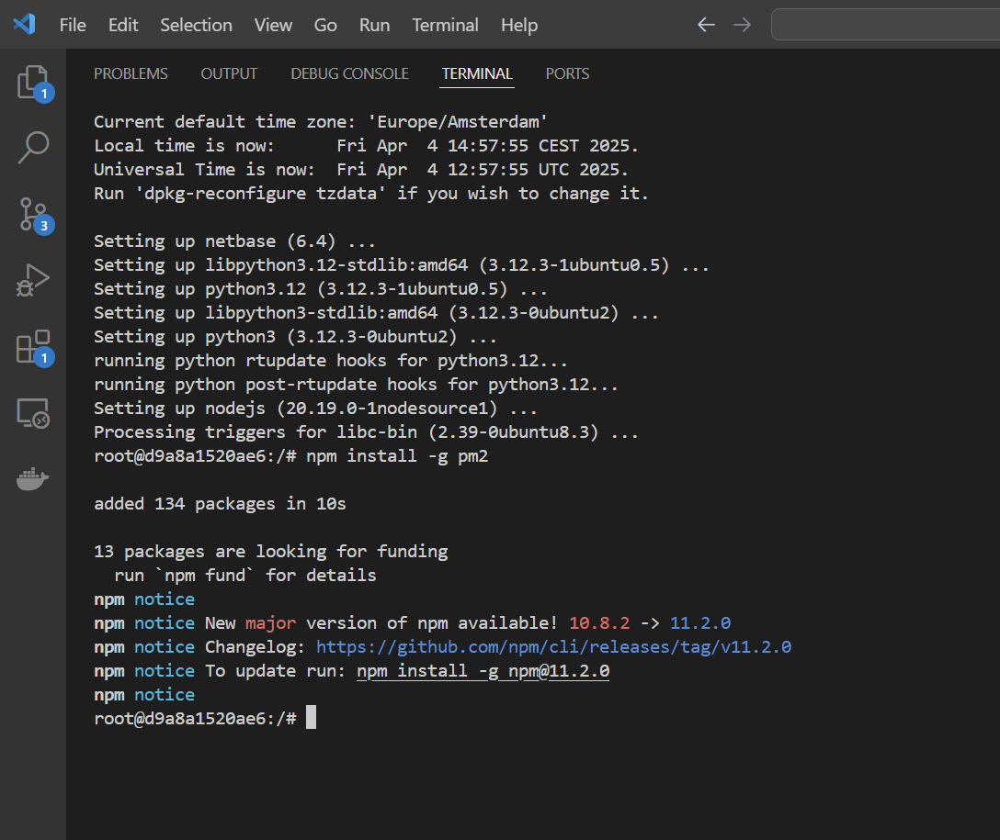

# Begeleidende Verantwoording – Cloud Computing - Docker

## Inleiding

In dit verslag verantwoord ik mijn werkzaamheden binnen het vak **Cloud Computing**, onderdeel van de **HBO-ICT** module **Operations Engineering**. De nadruk ligt op het inrichten, beheren en monitoren van een Proxmox-cluster inclusief geautomatiseerde uitrol van webapplicaties. In deze opdracht: Docker.

## Opdrachten van het project


Te doen:

Opdracht 1
- Installeer op een Proxmox node een Ubunbtu host (bijvoorkeur VM)  met daarop Docker.Registreer van alle lessons de uitkomsten met een 
screen recording/screenshots en leg het vast in je repository
- Build Image with DockerFile and create new Container op elk docker instantie op het Proxmox cluster.
- Docker Compose install op alle 3 Docker installaties op het Proxmox cluster
- Voer, vanaf stap 6,  geautomatiseerd de stappen uit op alle Docker omgevingen op het Proxmox cluster. Met als resultaat 3 swarms met 3 
manager(op elke procmode node 1) 
- Extra  - alle swarms via een centrale manager
- "Basic Docker Neworking Command" Zet de commando's in een script en laat het script de commando's een voor een uitvoeren.

Opdracht 2:
- Bekijk de volgende YouTube video : Docker networking is crazy (https://www.youtube.com/watch?v=bKFMS5C4CG0). Zet twee MySQL ( 
lesson8 van opdracht 1) Zet elke server in een apart subnet. Controleer of je vanuit jouw eigen subnet (waar ook de Proxmox nodes opstaan), 
je de MySQL containers kunt benaderen en of de servers elkaar kunnen benaderen. Mocht dat niet lukken pas dan de setting aan zodat wel 
kan,  script deze. Maak een korte beschrijving hoe je meerdere subnetten kunt creëren met Docker en waarom dit nuttig kan zijn.  Plaats 
deze ook op je repository.

Opdracht 3:
- Opdrachten:  Load Balancing en Reverse Proxy:
1) (2pt) Maak kennis met een product dat bovenstaande verzorgt:
https://doc.traefik.io/traefik/getting-started/quick-start/
Maak screenshots van de uitkomsten van bovenstaande en leg uit wat een Reverse proxy doet
1) (4pt) Kies een tutorial waarin men in Docker een load balancer/proxy toepast. Met behulp van Nginx. Volg de tutorial en leg per stap je 
handeling vast in je eigen repository. Voeg een Markdown file toe waarin je een verwijzing maakt naar de gevolgde tutorial. Maak een korte 
screen recording van de uitkomsten (werking van reverse proxy en scaling/load balancing).

---

### Voorbereiding

ik heb een script gemaakt voor het maken van een VM bedoeld voor docker.

```bash
#!/bin/bash

# === Instellingen ===
VMID=140 # Deze veranderen!
VMNAME="VMDocker"
CEPHPOOL="vm-storage"
DISK="vm-${VMID}-disk-0"
CLOUDIMG_URL="https://cloud-images.ubuntu.com/jammy/current/jammy-server-cloudimg-amd64.img"
CLOUDIMG="jammy-server-cloudimg-amd64.img"
IMG_RAW="ubuntu.raw"
IMG_RESIZED="ubuntu-20G.raw"
MEM=2048
CORES=2
IP="10.24.13.140/24"
GW="10.24.13.1"
USER="Dockeradmin"
SSH_PUBKEY_PATH="$HOME/.ssh/id_rsa.pub"

echo "📥 Download Ubuntu Cloud Image"
sudo wget -O $CLOUDIMG $CLOUDIMG_URL

echo "🔄 Converteer naar RAW"
sudo qemu-img convert -f qcow2 -O raw $CLOUDIMG $IMG_RAW

echo "📏 Vergroot RAW image naar 20G"
sudo qemu-img resize $IMG_RAW 20G

echo "📤 Upload RAW disk naar Ceph"
sudo rbd rm ${CEPHPOOL}/$DISK 2>/dev/null
sudo rbd import $IMG_RAW $DISK --dest-pool $CEPHPOOL

echo "🖥️ Maak VM aan"
sudo qm create $VMID \
  --name $VMNAME \
  --memory $MEM \
  --cores $CORES \
  --net0 virtio,bridge=vmbr0 \
  --scsihw virtio-scsi-pci \
  --ide2 ${CEPHPOOL}:cloudinit \
  --ostype l26 \
  --agent enabled=1

echo "💾 Koppel disk en stel boot in"
sudo qm set $VMID --scsi0 ${CEPHPOOL}:$DISK
sudo qm set $VMID --boot c --bootdisk scsi0

echo "⚙️ Configureer cloud-init"
sudo qm set $VMID \
  --ciuser $USER \
  --ipconfig0 ip=$IP,gw=$GW \
  --sshkey $SSH_PUBKEY_PATH

# 4. Start de VM
echo "🟢 Start VM $VMID..."
qm start $VMID

# 5. Wacht tot SSH beschikbaar is
echo "⏳ Wachten tot SSH werkt op $IP..."
until ssh -o ConnectTimeout=2 -o StrictHostKeyChecking=no -o BatchMode=yes $USER@${IP%/*} 'echo SSH OK' 2>/dev/null; do
  sleep 3
done

# 6. DNS fix
echo "🌐 DNS instellen op 1.1.1.1"
ssh $USER@${IP%/*} "echo 'nameserver 1.1.1.1' | sudo tee /etc/resolv.conf"

# 7. UFW firewall configureren
echo "🛡️ Firewall instellen"
ssh $USER@${IP%/*} << 'EOF'
sudo apt update
sudo apt install -y ufw
sudo ufw default deny incoming
sudo ufw allow 22 comment 'Allow SSH'
sudo ufw allow 80 comment 'Allow HTTP'
sudo ufw allow 443 comment 'Allow HTTPS'
sudo ufw --force enable
sudo ufw status verbose
EOF


# 8. Update & upgrade uitvoeren
# Hij gaat de eerste keer mis door een blokkade
ssh $USER@${IP%/*} "sudo kill -9 \$(pgrep apt-get)"
ssh $USER@${IP%/*} "sudo dpkg --configure -a"

echo "🔄 System update uitvoeren"
ssh $USER@${IP%/*} << 'EOF'
sudo apt update && sudo apt upgrade -y
EOF

# herstarten
sudo qm reboot 140

echo "✅ VM $VMID is volledig klaar en geconfigureerd op $IP"

```
---

### Opdracht 1

#### Lesson 4 - Installeren van docker met Ubuntu

screenshot van acties:


alle acties in script:

```bash
#!/bin/bash

IP="10.24.13.140"
USER="Dockeradmin"

echo "🔧 Docker prerequisites installeren..."
ssh ${USER}@${IP} << 'EOF'
sudo apt-get remove -y docker docker-engine docker.io containerd runc
sudo apt update
sudo apt install -y \
    ca-certificates \
    curl \
    gnupg \
    lsb-release
EOF

# 6. DNS fix
echo "🌐 DNS instellen op 1.1.1.1"
ssh $USER@${IP%/*} "echo 'nameserver 1.1.1.1' | sudo tee /etc/resolv.conf"

echo "🔐 Docker GPG key toevoegen..."
ssh ${USER}@${IP} << 'EOF'
sudo mkdir -p /etc/apt/keyrings
curl -fsSL https://download.docker.com/linux/ubuntu/gpg | gpg --dearmor | sudo tee /etc/apt/keyrings/docker.gpg > /dev/null
EOF

echo "➕ Docker repository toevoegen..."
ssh ${USER}@${IP} << 'EOF'
echo \
  "deb [arch=$(dpkg --print-architecture) signed-by=/etc/apt/keyrings/docker.gpg] \
  https://download.docker.com/linux/ubuntu \
  $(lsb_release -cs) stable" | \
  sudo tee /etc/apt/sources.list.d/docker.list > /dev/null
EOF

echo "📦 Docker installeren..."
ssh ${USER}@${IP} << 'EOF'
sudo apt-get update
sudo apt-get install -y docker-ce docker-ce-cli containerd.io docker-buildx-plugin docker-compose-plugin
EOF

# DNS fixen
ssh ${USER}@${IP%/*} "echo 'nameserver 1.1.1.1' | sudo tee /etc/resolv.conf > /dev/null"


echo "👤 Toevoegen aan docker groep..."
ssh ${USER}@${IP} << EOF
sudo usermod -aG docker $USER
EOF

echo "✅ Docker installatie klaar! Reboot de VM om docker zonder sudo te gebruiken."
```

Hier toon ik commando docker ps en docker images.


Docker staat op de VM!
Ik heb hello world aangevraagd, en die krijg ik terug!


---

#### Lesson 7 - Build Image with DockerFile and create new Container op elk docker instantie op het Proxmox cluster.

Dockerfile maken:


Builden van Dockerfile:


Runnen van de build.


In Les 8 wordt op elke node in het cluster docker geinstalleerd.

---

#### Lesson 8 - Docker Compose install op alle 3 Docker installaties op het Proxmox cluster. 

Opdracht:
elke node van het cluster moet een VM + docker + docker compose.
Momenteel is er alleen een docker op de VM in node1.

Voorbereidende stappen:
- script gebruiken om docker te installeren op de andere 2 nodes.


- Docker composer installeren

Blijkt al geinstalleerd te zijn!


stappen om een docker_compose.yml te maken:


docker compose up werkt:


- Tailscale erop zetten zodat server bereikbaar is


Vervolgens de docker-compose.yml maken:

```yml
version: "4.2"

services:
  mysql:
    image: mysql:5.7
    restart: always
    environment:
      MYSQL_ROOT_PASSWORD: secret
      MYSQL_DATABASE: todos
    volumes:
      - mysql-data:/var/lib/mysql
    networks:
      - todo-app

  app:
    image: node:12-alpine
    command: sh -c "yarn install && yarn run dev"
    ports:
      - 3000:3000
    working_dir: /app
    volumes:
      - ./:/app
    environment:
      MYSQL_HOST: mysql
      MYSQL_USER: root
      MYSQL_PASSWORD: secret
      MYSQL_DB: todos
    depends_on:
      - mysql
    networks:
      - todo-app

volumes:
  mysql-data:

networks:
  todo-app:
```

Nog eens installeren docker-compose, het ging niet helemaal goed

```bash
Dockeradmin@VMDocker:~$ VERSION=1.29.2
Dockeradmin@VMDocker:~$ sudo curl -L "https://github.com/docker/compose/releases/download/${VERSION}/docker-compose-$(uname -s)-$(uname -m)" \
  -o /usr/local/bin/docker-compose
  % Total    % Received % Xferd  Average Speed   Time    Time     Time  Current
                                 Dload  Upload   Total   Spent    Left  Speed
  0     0    0     0    0     0      0      0 --:--:--  0:00:06 --:--:--     0^C
Dockeradmin@VMDocker:~$ echo 'nameserver 1.1.1.1' | sudo tee /etc/resolv.conf
nameserver 1.1.1.1
Dockeradmin@VMDocker:~$ sudo curl -L "https://github.com/docker/compose/releases/download/${VERSION}/docker-compose-$(uname -s)-$(uname -m)"   -o /usr/local/bin/docker-compose
  % Total    % Received % Xferd  Average Speed   Time    Time     Time  Current
                                 Dload  Upload   Total   Spent    Left  Speed
  0     0    0     0    0     0      0      0 --:--:-- --:--:-- --:--:--     0
100 12.1M  100 12.1M    0     0  10.4M      0  0:00:01  0:00:01 --:--:-- 43.7M
Dockeradmin@VMDocker:~$ sudo chmod +x /usr/local/bin/docker-compose
Dockeradmin@VMDocker:~$ docker-compose --version
docker-compose version 1.29.2, build unknown
Dockeradmin@VMDocker:~$ 
```


Internet deed het niet goed, hierbij ook gefixed:

```bash
Dockeradmin@VMDocker:~/todo-app$ sudo nano /etc/docker/daemon.json
Dockeradmin@VMDocker:~/todo-app$ sudo systemctl restart docker
Dockeradmin@VMDocker:~/todo-app$ docker-compose down
docker-compose up -d
Stopping todo-app_mysql_1 ... done
Removing todo-app_app_1   ... done                                                                                                                                               
Removing todo-app_mysql_1 ... done                                                                                                                                               
Removing network todo-app_todo-app
WARNING: The Docker Engine you're using is running in swarm mode.

Compose does not use swarm mode to deploy services to multiple nodes in a swarm. All containers will be scheduled on the current node.

To deploy your application across the swarm, use `docker stack deploy`.

Creating network "todo-app_todo-app" with the default driver
Creating todo-app_mysql_1 ... done
Creating todo-app_app_1   ... done
Dockeradmin@VMDocker:~/todo-app$ docker-compose logs -f app
Attaching to todo-app_app_1
app_1    | yarn install v1.22.18
app_1    | warning package.json: No license field
app_1    | warning todo-app@1.0.0: No license field
app_1    | [1/4] Resolving packages...
app_1    | [2/4] Fetching packages...
app_1    | [3/4] Linking dependencies...
app_1    | [4/4] Building fresh packages...
app_1    | success Saved lockfile.
app_1    | Done in 3.95s.
app_1    | yarn run v1.22.18
app_1    | warning package.json: No license field
app_1    | $ node index.js
app_1    | ✅ App luistert op http://localhost:3000

```

laatste commando's:

```bash
docker-compose up -d
docker-compose logs -f app
```


---

#### Lesson 9 - Voer, vanaf stap 6, geautomatiseerd de stappen uit op alle Docker omgevingen op het Proxmox cluster. Met als resultaat 3 swarms met 3 manager(op elke procmode node 1) 

- Manager gemaakt op pve02
- firewall geopend voor swarm op alle nodes en docker VM's:
```bash
sudo ufw allow 2377/tcp
sudo ufw allow 7946/tcp
sudo ufw allow 7946/udp
sudo ufw allow 4789/udp
```
- Worker gemaakt met gekregen code:


- Lijst met centrale manager en worker nodes:


Hierbij de automaat die meteen op alle swarms uitgevoerd wordt met een service.
- service gemaakt over de swarm


---

#### Lesson 10 - "Basic Docker Neworking Command" Zet de commando's in een script en laat het script de commando's een voor een uitvoeren.


```bash
Dockeradmin@VMDocker:~$ # Configuratie
NETWORK_NAME="multi-host-network"
SUBNET="10.10.36.0/24"
GATEWAY="10.10.36.1"
CONTAINER1="test-container-1"
CONTAINER2="test-container-2"
IP1="10.10.36.101"
IP2="10.10.36.102"
Dockeradmin@VMDocker:~$ # 1. Maak een custom bridge netwerk aan
echo "🌐 Netwerk aanmaken..."
docker network create \
  --driver bridge \
  --subnet=$SUBNET \
  --gateway=$GATEWAY \
  $NETWORK_NAME
🌐 Netwerk aanmaken...
a1dcc802d773ced575edf3c75507e864be6874bfdb4ece7c870262a772920135
Dockeradmin@VMDocker:~$ # 2. Start eerste container met statisch IP-adres
echo "🚀 Start $CONTAINER1 met IP $IP1"
docker run -dit --name $CONTAINER1 --network $NETWORK_NAME --ip $IP1 alpine:latest sh
🚀 Start test-container-1 met IP 10.10.36.101
a5aaf1ebfc5714038675696767a439a9d3483cfffe30231282be5ada051f0798
Dockeradmin@VMDocker:~$ # 3. Start tweede container met statisch IP-adres
echo "🚀 Start $CONTAINER2 met IP $IP2"
docker run -dit --name $CONTAINER2 --network $NETWORK_NAME --ip $IP2 alpine:latest sh
🚀 Start test-container-2 met IP 10.10.36.102
c6f69be0980ae2bda166fe5b68a5c6d58c9ddea7251b5b7d3029712abb36a9da
Dockeradmin@VMDocker:~$ # 4. Test netwerkconnectie (vanuit container 1 naar container 2)
echo "📡 Test netwerkverbinding van $CONTAINER1 naar $CONTAINER2 ($IP2)"
docker exec $CONTAINER1 ping -c 4 $IP2
📡 Test netwerkverbinding van test-container-1 naar test-container-2 (10.10.36.102)
PING 10.10.36.102 (10.10.36.102): 56 data bytes
64 bytes from 10.10.36.102: seq=0 ttl=64 time=0.258 ms
64 bytes from 10.10.36.102: seq=1 ttl=64 time=0.127 ms
64 bytes from 10.10.36.102: seq=2 ttl=64 time=0.129 ms
64 bytes from 10.10.36.102: seq=3 ttl=64 time=0.149 ms

--- 10.10.36.102 ping statistics ---
4 packets transmitted, 4 packets received, 0% packet loss
round-trip min/avg/max = 0.127/0.165/0.258 ms
Dockeradmin@VMDocker:~$ # 5. Laat netwerkinfo zien
echo "📋 Docker netwerken:"
docker network ls
docker network inspect $NETWORK_NAME
📋 Docker netwerken:
NETWORK ID     NAME                 DRIVER    SCOPE
ced08265645a   bridge               bridge    local
b9aceaf9dcc5   docker_gwbridge      bridge    local
415fa37c2337   host                 host      local
yszsqrb7qhy4   ingress              overlay   swarm
a1dcc802d773   multi-host-network   bridge    local
373591a4a3e6   none                 null      local
[
    {
        "Name": "multi-host-network",
        "Id": "a1dcc802d773ced575edf3c75507e864be6874bfdb4ece7c870262a772920135",
        "Created": "2025-04-04T09:04:50.692594791Z",
        "Scope": "local",
        "Driver": "bridge",
        "EnableIPv4": true,
        "EnableIPv6": false,
        "IPAM": {
            "Driver": "default",
            "Options": {},
            "Config": [
                {
                    "Subnet": "10.10.36.0/24",
                    "Gateway": "10.10.36.1"
                }
            ]
        },
        "Internal": false,
        "Attachable": false,
        "Ingress": false,
        "ConfigFrom": {
            "Network": ""
        },
        "ConfigOnly": false,
        "Containers": {
            "a5aaf1ebfc5714038675696767a439a9d3483cfffe30231282be5ada051f0798": {
                "Name": "test-container-1",
                "EndpointID": "7ea15f7962d2b2136a4bc550315dae4fee8fba4a3ed9aa4c0fe8bfdd649f6868",
                "MacAddress": "22:67:1a:ee:74:9a",
                "IPv4Address": "10.10.36.101/24",
                "IPv6Address": ""
            },
            "c6f69be0980ae2bda166fe5b68a5c6d58c9ddea7251b5b7d3029712abb36a9da": {
                "Name": "test-container-2",
                "EndpointID": "ae9a3727775e48861bfff3d963645fd09e661448041803c5bfa02737f9098255",
                "MacAddress": "66:19:d9:c5:ee:77",
                "IPv4Address": "10.10.36.102/24",
                "IPv6Address": ""
            }
        },
        "Options": {},
        "Labels": {}
    }
]
Dockeradmin@VMDocker:~$ # Extra: verbind container1 opnieuw en voeg aliassen toe
echo "🔗 Voeg aliassen toe aan $CONTAINER1"
docker network disconnect $NETWORK_NAME $CONTAINER1
docker network connect --alias db --alias mysql $NETWORK_NAME $CONTAINER1
🔗 Voeg aliassen toe aan test-container-1
Dockeradmin@VMDocker:~$ # Extra: Verwijder verbinding container1
echo "❌ Verbreek verbinding van $CONTAINER1 met netwerk"
docker network disconnect $NETWORK_NAME $CONTAINER1
❌ Verbreek verbinding van test-container-1 met netwerk
```

De CLI commando's waren succesvol. Vervolgens is er een script gemaakt om alles in een flow te laten gebeuren:

```bash
#!/bin/bash

# Configuratie
NETWORK_NAME="multi-host-network"
SUBNET="10.10.36.0/24"
GATEWAY="10.10.36.1"
CONTAINER1="test-container-1"
CONTAINER2="test-container-2"
IP1="10.10.36.101"
IP2="10.10.36.102"

# 1. Maak een custom bridge netwerk aan
echo "🌐 Netwerk 'multi-host-netwerk' aanmaken..."
docker network create \
  --driver bridge \
  --subnet=$SUBNET \
  --gateway=$GATEWAY \
  $NETWORK_NAME

# 2. Start eerste container met statisch IP-adres
echo "🚀 Start $CONTAINER1 met IP $IP1"
docker run -dit --name $CONTAINER1 --network $NETWORK_NAME --ip $IP1 alpine:latest sh

# 3. Start tweede container met statisch IP-adres
echo "🚀 Start $CONTAINER2 met IP $IP2"
docker run -dit --name $CONTAINER2 --network $NETWORK_NAME --ip $IP2 alpine:latest sh

# 4. Test netwerkconnectie (vanuit container 1 naar container 2)
echo "📡 Test netwerkverbinding van $CONTAINER1 naar $CONTAINER2 ($IP2)"
docker exec $CONTAINER1 ping -c 4 $IP2

# 5. Laat netwerkinfo zien
echo "📋 Docker netwerken laten zien, hierin zit een mukti-host-netwerk!"
docker network ls
docker network inspect $NETWORK_NAME

# 6 verbind container1 opnieuw en voeg aliassen toe
echo "🔗 Voeg aliassen toe aan $CONTAINER1"
docker network disconnect $NETWORK_NAME $CONTAINER1
docker network connect --alias db --alias mysql $NETWORK_NAME $CONTAINER1

# 6 disconnect de containers, verwijder containers en verwijder netwerk
echo "Disconnect en verwijder netwerk 'multi-host-netwerk'"
docker network disconnect multi-host-network test-container-2
docker rm -f $CONTAINER1 $CONTAINER2
docker network rm $NETWORK_NAME
docker network prune -f

# 7 controle dat alles verwijdert is.
echo "Laat zien dat het multi-host-netwerk niet meer zichtbaar is: (er is geen multi-host-netwerk meer)"
docker network ls
docker network inspect $NETWORK_NAME

echo "✅ Setup voltooid!"
```

Hiervan is een film gemaakt: `Les10-netwerk_docker_script.mp4` toegevoegd als bijlage buiten GitHub.

---

### Opdracht 2


#### Concrete opdracht:

Opdracht 2:
- Bekijk de volgende YouTube video : Docker networking is crazy (https://www.youtube.com/watch?v=bKFMS5C4CG0). Zet twee MySQL ( 
lesson8 van opdracht 1) Zet elke server in een apart subnet. Controleer of je vanuit jouw eigen subnet (waar ook de Proxmox nodes opstaan), 
je de MySQL containers kunt benaderen en of de servers elkaar kunnen benaderen. Mocht dat niet lukken pas dan de setting aan zodat wel 
kan,  script deze. Maak een korte beschrijving hoe je meerdere subnetten kunt creëren met Docker en waarom dit nuttig kan zijn.  Plaats 
deze ook op je repository.

#### Stap 1: Maak twee bridge-netwerken aan met eigen subnetten

Configuratie:
```bash
#!/bin/bash
SUBNET1="10.10.8.0/24"
SUBNET2="10.10.9.0/24"
NET1="mysql_net_1"
NET2="mysql_net_2"
CONTAINER1="mysql1"
CONTAINER2="mysql2"
CONTAINER1_IP="10.10.8.10"
CONTAINER2_IP="10.10.9.10"
```

De volgende commando wordt uitgevoerd in de docker container:

```bash
docker network create \
  --driver bridge \
  --subnet 10.10.8.0/24 \
  mysql_net_1

docker network create \
  --driver bridge \
  --subnet 10.10.9.0/24 \
  mysql_net_2
```

screenshot


#### Stap 2: Twee MySQL containers opzetten

```
docker run -d \
  --name mysql1 \
  --network mysql_net_1 \
  --ip 10.10.8.10 \
  -p 3307:3306 \
  -e MYSQL_ROOT_PASSWORD=secret \
  mysql:5.7

docker run -d \
  --name mysql2 \
  --network mysql_net_2 \
  --ip 10.10.9.10 \
  -p 3308:3306 \
  -e MYSQL_ROOT_PASSWORD=secret \
  mysql:5.7
```


#### Testen connectie binnen Docker VM


#### Testen connectie binnen cluster buiten docker VM

Via de telnet is de connectie gelukt om te connecten met de container!


#### Testen connectie met andere SQL binnen SQL in de container
Ook binnen de sql applicaties probeer ik elkaar te bereiken.

```bash
docker exec -it mysql1 bash
mysql -uroot -psecret --host=10.10.9.10

quit
mysql -uroot -psecret --host=10.10.9.10
```

Dit werkt:


Het is dus gelukt om intern, alsook buiten de VM (met docker) om vanuit het eigen subnet contact te maken met de container.

#### Scripten van 2 subnetten met 2 containers met SQL

opgeslagen in file Opdracht2_subnetten_docker.sh

```bash
#!/bin/bash
SUBNET1="10.10.8.0/24"
SUBNET2="10.10.9.0/24"
NET1="mysql_net_1"
NET2="mysql_net_2"
CONTAINER1="mysql1"
CONTAINER2="mysql2"
CONTAINER1_IP="10.10.8.10"
CONTAINER2_IP="10.10.9.10"

# aanmaken subnet 1
docker network create \
  --driver bridge \
  --subnet $SUBNET1 \
  $NET1

# aanmaken subnet 2
docker network create \
  --driver bridge \
  --subnet $SUBNET2 \
  $NET2

# aanmaken container1 met SQL in subnet 1
docker run -d \
  --name $CONTAINER1 \
  --network $NET1 \
  --ip $CONTAINER1_IP \
  -p 3307:3306 \
  -e MYSQL_ROOT_PASSWORD=secret \
  mysql:5.7

# aanmaken container2 met SQL in subnet 2
docker run -d \
  --name $CONTAINER2 \
  --network $NET2 \
  --ip $CONTAINER2_IP \
  -p 3308:3306 \
  -e MYSQL_ROOT_PASSWORD=secret \
  mysql:5.7
```

Uitvoerbaar maken en aftrappen:
```bash
chmod u+x Opdracht2_subnetten_docker.sh
./Opdracht2_subnetten_docker.sh
```

#### Beschrijving waarom deze subnetten handig zijn

In Docker kun je eenvoudig meerdere netwerken aanmaken met hun eigen subnetten en gateways. Deze netwerken zijn volledig van elkaar geïsoleerd — tenzij je expliciet containers met elkaar verbindt.

Voordelen van meerdere subnetten:
1. Isolatie van services  
Je kunt containers scheiden per omgeving of per functie:
Bijvoorbeeld: een dev-netwerk voor ontwikkelcontainers
En een prod-netwerk voor live containers
Of: frontend en backend in aparte netwerken
Zo beperk je onbedoelde communicatie tussen containers.

2. Verbeterde beveiliging  
Bridge-netwerken zijn standaard niet verbonden met elkaar. Alleen containers binnen hetzelfde netwerk kunnen met elkaar praten.
Je kunt dus bewust selectief toegang geven, door bijvoorbeeld alleen bepaalde containers in meerdere netwerken te plaatsen via:
`docker network connect <netwerk> <container>`

3. Simulatie van complexe netwerkomgevingen  
Door meerdere subnetten aan te maken, kun je eenvoudig testscenario’s nabootsen zoals:
- Meerdere netwerken (bijv. LAN)
- Externe services
- Firewall-regels testen tussen netwerken  

4. Multi-homed containers  
Docker ondersteunt containers die in meerdere netwerken tegelijk zitten. Zo kun je bijvoorbeeld een MySQL-database zowel in een intern netwerk (voor backend) als een extern netwerk (voor monitoring) plaatsen.

### Opdracht 3

Opdracht 3:
- Opdrachten:  Load Balancing en Reverse Proxy:
1) (2pt) Maak kennis met een product dat bovenstaande verzorgt:
https://doc.traefik.io/traefik/getting-started/quick-start/
Maak screenshots van de uitkomsten van bovenstaande en leg uit wat een Reverse proxy doet
1) (4pt) Kies een tutorial waarin men in Docker een load balancer/proxy toepast. Met behulp van Nginx. Volg de tutorial en leg per stap je 
handeling vast in je eigen repository. Voeg een Markdown file toe waarin je een verwijzing maakt naar de gevolgde tutorial. Maak een korte 
screen recording van de uitkomsten (werking van reverse proxy en scaling/load balancing).

#### Opdracht 3.1 Reverse Proxy

create official Traefik image screenshot:


`docker compose up -d reverse proxy`
`http://localhost:8080/api/rawdata`

screenshot: 


whoami aangemaakt:


Curl commando:


Nog een instantie van whoami gemaakt. De curl commando laat nu verschillende resultaten zien:


**Uitleg wat een reverse proxy doet**

Een reverse proxy ontvangt inkomend verkeer van clients en stuurt dit door naar de juiste backend-service. In plaats van dat de client rechtstreeks communiceert met de backend, communiceert deze met de reverse proxy. Dit biedt voordelen zoals:

- Load balancing (verkeer verdelen over meerdere servers)
- SSL termination (HTTPS afhandeling op de proxy)
- Routing o.b.v. domein of pad
- Verbergen van interne netwerken/services

Traefik is een moderne reverse proxy die automatisch Docker containers detecteert en routes aanmaakt.

#### Opdracht 3.2 Load Balancing

De tutorial die gevolg heb:
https://medium.com/@itsvedp/optimizing-backend-performance-nginx-load-balancer-in-docker-container-28c445ecdeb5

1) Start een Ubuntu container met poortkoppeling
`docker run -it -p 8081:80 ubuntu`


2) Installeer NGINX en vim
`apt-get install nginx -y`
`apt-get install vim -y`

3) Installeer Node.js + pm2
```bash
apt-get install -y curl
curl -fsSL https://deb.nodesource.com/setup_20.x -o nodesource_setup.sh
bash nodesource_setup.sh
apt-get install -y nodejs
```

tussenstap, nodejs install:


tussenstap, pm2 install:



3) Maak 3 mappen en bestanden met servers aan

```bash
cd /
mkdir servers
cd servers
mkdir server1 server2 server3

# server 1
cd /servers/server1
npm init -y
npm i express
vim app1.js

# server 2
cd /servers/server2
npm init -y
npm i express
vim app2.js

# server 3
cd /servers/server3
npm init -y
npm i express
vim app3.js
```

Daarna in app1.js/app2.js en app3.js:

```vim
# app1.js
const express = require("express");
const app = express();
app.get("/", (req, res)=>{ res.send("response from server 1"); });
app.listen(3001, ()=>{ console.log("App running on port 3001"); });

# app2.js
const express = require("express");
const app = express();
app.get("/", (req, res)=>{ res.send("response from server 2"); });
app.listen(3002, ()=>{ console.log("App running on port 3002"); });

# app3.js
const express = require("express");
const app = express();
app.get("/", (req, res)=>{ res.send("response from server 3"); });
app.listen(3003, ()=>{ console.log("App running on port 3003"); });
```

eerste server ingesteld:


alle servers ingesteld:


4) Start de servers met pm2
```bash
pm2 start /servers/server1/app1.js
pm2 start /servers/server2/app2.js
pm2 start /servers/server3/app3.js
pm2 list
```


5)  Configureer NGINX als load balancer

```bash
rm /etc/nginx/nginx.conf
touch /etc/nginx/nginx.conf
vim /etc/nginx/nginx.conf
```

```vim
events{}

http {
    upstream servers {
        server localhost:3001;
        server localhost:3002;
        server localhost:3003;
    }

    server {
        listen 80;

        location / {
            proxy_pass http://servers;
        }
    }
}
```

ingesteld:


```bash
nginx -t
nginx # nginx moet expliciet gestart worden.
nginx -s reload
```

6) Test de Load Balancer

browse:
http://localhost:8081/

result:
response from server 1
response from server 2
response from server 3

Test uitgevoerd:


Er is ook een video `round_robin_load_balance.mp3` die de round robin aantoont.

